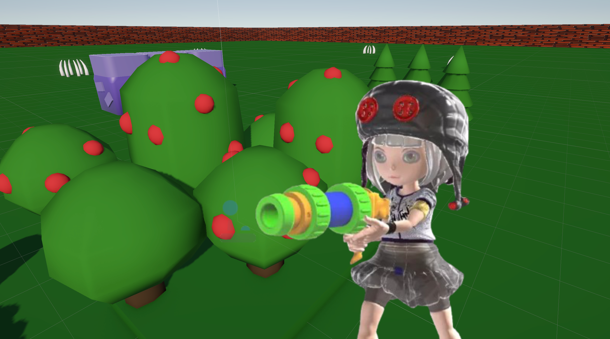

# Garden Siege

Spring-themed wave-defense game made in Unity 6.

Play on itch.io: [https://daniyarx.itch.io/garden-siege](https://daniyarx.itch.io/garden-siege)

## Game Description
In **Garden Siege**, you play as JellyFishGirl and defend your spring crops from waves of pests.  
Use your spray weapon, survive each wave, and keep at least part of the harvest alive.

## Core Gameplay Loop
1. A wave starts.
2. Enemies spawn at random points and move toward crops.
3. You fight them and protect the field.
4. Next wave gets harder (more enemies, faster movement, higher damage).

## Victory / Defeat
- **Victory:** survive all waves.
- **Defeat:** all crops are destroyed or player HP reaches zero.

## Controls
- `W/A/S/D` - Move
- `Left Mouse Button` or `Space` - Spray attack

## Current Features
- Player movement with camera follow
- Enemy wave spawning system
- Enemy pathing toward crops
- Health system (player, crops, enemies)
- Enemy world-space HP bars
- HUD (Wave, Crops HP)
- Victory / Defeat UI with Restart and Quit
- SFX + background music + wave-start stinger

## Built With
- Unity 6
- Universal Render Pipeline (URP)
